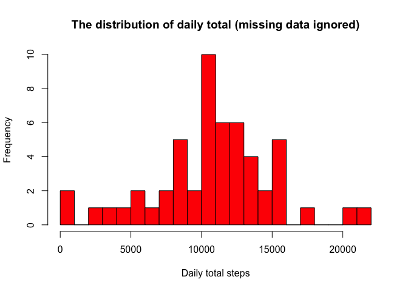
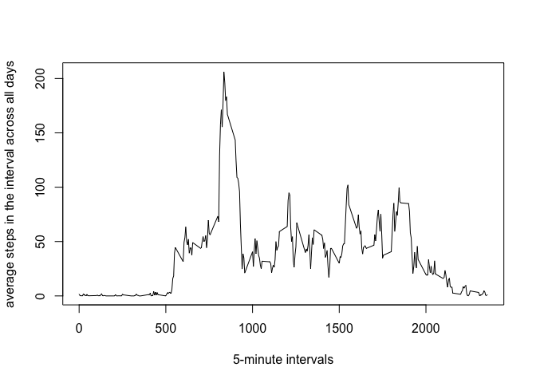
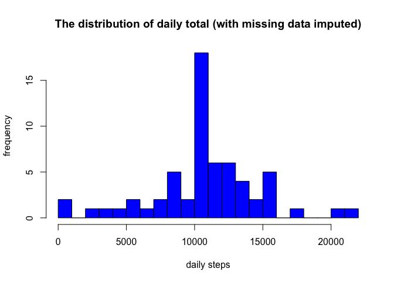

# Reproducible Research: Peer Assessment 1
This assignment makes use of data from a personal activity monitoring device. This device collects data at 5 minute intervals throughout the day. The data consists of two months of data from an anonymous individual collected during the months of October and November, 2012 and include the number of steps taken in 5 minute intervals each day.

This document presents the results from Project Assignment 1 in the Coursera course Reproducible Research, written in a single R markdown document that can be processed by knitr and transformed into an HTML file.

## Loading and preprocessing the data
##### Firstly we load the neccesary libraries

```r
library(ggplot2)
library(knitr)
library(lattice)
opts_chunk$set(echo = TRUE)
```
##### 1. For this assignment, the first step is to load the data file “activity.csv” by read.csv

```r
if(!file.exists('activity.csv')){
    unzip('activity.zip')
}
## Read the data using read.csv
activityData <- read.csv("activity.csv", header = TRUE, sep = ',', colClasses = c("numeric", "character","integer"), na.strings="NA")
```

##### 2. Do a quick data analysis on the values loaded to understand the dataset

```r
str(activityData)
```

```
## 'data.frame':	17568 obs. of  3 variables:
##  $ steps   : num  NA NA NA NA NA NA NA NA NA NA ...
##  $ date    : chr  "2012-10-01" "2012-10-01" "2012-10-01" "2012-10-01" ...
##  $ interval: int  0 5 10 15 20 25 30 35 40 45 ...
```

```r
head(activityData)
```

```
##   steps       date interval
## 1    NA 2012-10-01        0
## 2    NA 2012-10-01        5
## 3    NA 2012-10-01       10
## 4    NA 2012-10-01       15
## 5    NA 2012-10-01       20
## 6    NA 2012-10-01       25
```
## What is mean total number of steps taken per day?
##### 3. We summarize and calculate the number of steps per day 

- Calculate the total number of steps taken per day.
- Make a histogram of the total number of steps taken each day.
- Calculate and report the mean and median of the total number of steps taken per day.

```r
activityData$date <- as.Date(activityData$date)
activityDataCleaned <- subset(activityData, !is.na(activityData$steps))

head(activityDataCleaned)
```

```
##     steps       date interval
## 289     0 2012-10-02        0
## 290     0 2012-10-02        5
## 291     0 2012-10-02       10
## 292     0 2012-10-02       15
## 293     0 2012-10-02       20
## 294     0 2012-10-02       25
```
##### 5. Calculate the mean and median total number of steps taken per day

```r
# Summarize and aggregate the data to get teh total number of steps per day
stepsPerDay <- tapply(activityDataCleaned$steps, activityDataCleaned$date, sum, na.rm=TRUE, simplify=T)
stepsPerDay <- stepsPerDay[!is.na(stepsPerDay)]
# Analyize the aggregated values  
head(stepsPerDay)
```

```
## 2012-10-02 2012-10-03 2012-10-04 2012-10-05 2012-10-06 2012-10-07 
##        126      11352      12116      13294      15420      11015
```

```r
# Build a histogram with the aggregated information 
hist(x=stepsPerDay,
     col="red",
     breaks=20,
     xlab="Daily total steps",
     ylab="Frequency",
     main="The distribution of daily total (missing data ignored)")
```

<!-- -->

```r
# Next, calculate the mean and median total number of steps taken per day
# The Mean number of Steps Per Day
mean(stepsPerDay)
```

```
## [1] 10766.19
```

```r
# The Median number of Steps Per Day
median(stepsPerDay)
```

```
## [1] 10765
```

##### 6. What is the average daily activity pattern?

To exam the average daily activity pattern, we create a time series plot (i.e. type = “l”) of the 5-minute interval (x-axis) and the average number of steps taken, averaged across all days (y-axis)


```r
int_avg <- tapply(activityDataCleaned$steps, activityDataCleaned$interval, mean, na.rm=TRUE, simplify=T)
df_ia <- data.frame(interval=as.integer(names(int_avg)), avg=int_avg)
# Plot the interval data 
with(df_ia,
     plot(interval,
          avg,
          type="l",
          xlab="5-minute intervals",
          ylab="average steps in the interval across all days"))
```

<!-- -->

Next is to check which 5-minute interval, on average across all the days in the dataset, contains the maximum number of steps:


```r
# Calculate max values of the dataset
max_steps <- max(df_ia$avg)
df_ia[df_ia$avg == max_steps, ]
```

```
##     interval      avg
## 835      835 206.1698
```

## Imputing missing values
##### 7. Imputting the NA / Missing Values

First, we calculate and report the total number of missing values in the dataset (i.e. the total number of rows with NAs):


```r
# Calculate the number of empty values in the dataset 
activityDataNA <- sum(is.na(activityData$steps))
# Print the number of empty values 
cat("The original dataset has the following number of empty values: ",activityDataNA)
```

```
## The original dataset has the following number of empty values:  2304
```

```r
df_ia[df_ia$avg == max_steps, ]
```

```
##     interval      avg
## 835      835 206.1698
```

We use a simple strategy for filling in all of the missing values in the dataset. If a 5-minute interval has missing value, we use the mean for that 5-minute interval.

We create a new data frame df_impute that is equal to the original dataset but with the missing data filled in (using mean for that interval for imputation):

```r
df_impute <- activityData
ndx <- is.na(df_impute$steps)
int_avg <- tapply(activityDataCleaned$steps, activityDataCleaned$interval, mean, na.rm=TRUE, simplify=T)
df_impute$steps[ndx] <- int_avg[as.character(df_impute$interval[ndx])]
```
Make a histogram of the total number of steps taken each day and calculate and report the mean and median total number of steps taken per day.

```r
new_stepsPerDay <- tapply(df_impute$steps, df_impute$date, sum, na.rm=TRUE, simplify=T)

# Next, calculate the mean and median total number of steps taken per day
# The Mean number of Steps Per Day
mean(new_stepsPerDay)
```

```
## [1] 10766.19
```

```r
# The Median number of Steps Per Day
median(new_stepsPerDay)
```

```
## [1] 10766.19
```

```r
hist(x=new_stepsPerDay,
     col="blue",
     breaks=20,
     xlab="daily steps",
     ylab="frequency",
     main="The distribution of daily total (with missing data imputed)")
```

<!-- -->

Based on the imputed data set, the new mean is 10766 and the new median is 10766 . 

Compare with the original mean 10766 and median 10765 , the mean doesn't change, and the median has a small change. In fact, the new median becomes identical to the mean. One possible explanation is that when we fill the missing data for the intervals, we use means for intervals, so we have more data close or identical to the means, and median is shifted and becomes identical to the mean.


## Are there differences in activity patterns between weekdays and weekends?
##### 8. Determine the pattern between Weekdays and Weekends

First we create a new factor variable “wk” in the dataset with two levels - “weekday” and “weekend” indicating whether a given date is a weekday or weekend day.

```r
# helper function to decide if a day is a week day or not
is_weekday <- function(d) {
    wd <- weekdays(d)
    ifelse (wd == "Saturday" | wd == "Sunday", "weekend", "weekday")
}

wx <- sapply(df_impute$date, is_weekday)
df_impute$wk <- as.factor(wx)
head(df_impute)
```

```
##       steps       date interval      wk
## 1 1.7169811 2012-10-01        0 weekday
## 2 0.3396226 2012-10-01        5 weekday
## 3 0.1320755 2012-10-01       10 weekday
## 4 0.1509434 2012-10-01       15 weekday
## 5 0.0754717 2012-10-01       20 weekday
## 6 2.0943396 2012-10-01       25 weekday
```

Next we make a panel plot containing a time series plot (i.e. type = “l”) of the 5-minute interval (x-axis) and the average number of steps taken, averaged across all weekday days or weekend days (y-axis).

```r
wk_df <- aggregate(steps ~ wk+interval, data=df_impute, FUN=mean)

xyplot(steps ~ interval | factor(wk),
       layout = c(1, 2),
       xlab="Interval",
       ylab="Number of steps",
       type="l",
       lty=1,
       data=wk_df)
```

<!-- -->

From the panel plot it looks like the weekday activities arise earlier than the weekends - weekday activities arise around 5~6am and weekend activities arise around 8am. We can also observe that from 10am to 5pm, the weekends have higher activity levels than the weekdays.
